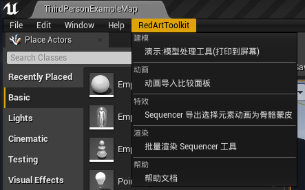
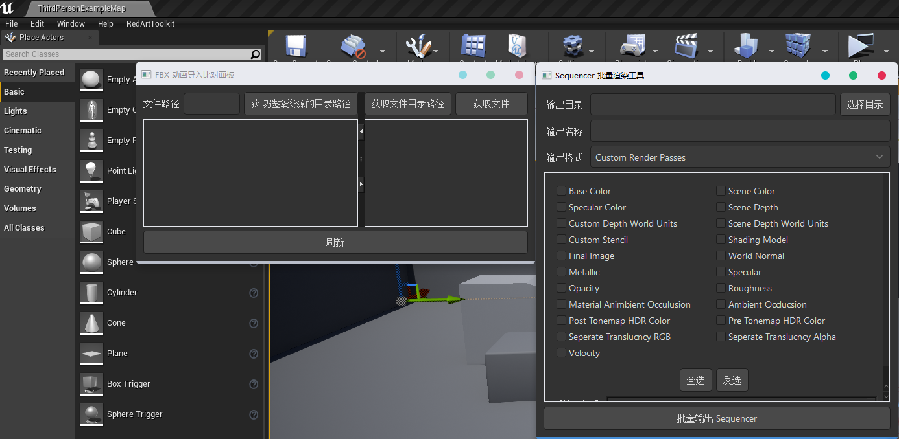

# Unreal-PyToolkit

嵌入 Python PySide 模块进行界面开发





> &emsp;&emsp;插件在 4.25.1 下运行没有问题。

## Python 依赖

Content 目录下的 Python 目录默认会添加到 Python sys.path 里面
Python 目录里面添加的依赖库如下:
+ [PySide](https://pypi.org/project/PySide/) 
+ [FBX Python SDK](https://www.autodesk.com/developer-network/platform-technologies/fbx-sdk-2020-1)
+ [dayu_widgets](https://github.com/phenom-films/dayu_widgets)
+ [dayu_path](https://github.com/phenom-films/dayu_path)
+ [singledispatch](https://pypi.org/project/singledispatch/)
+ [Qt.py](https://github.com/mottosso/Qt.py)

## 插件配置

> &emsp;&emsp;插件参考官方 Python 插件的 Startup 脚本启动方案，自动执行 Content 目录下的 initialize.py 脚本
> &emsp;&emsp;initialize.py 脚本在 Unreal 里面初始化 Qt 的运行环境。

> &emsp;&emsp;读取 Content 目录下的 menu.json 配置生成 Unreal 菜单
> &emsp;&emsp;读取 Content 目录下的 main.css  作为样式补充

> &emsp;&emsp;重载 QWidget 的 show 方法，实现窗口唯一、Unreal窗口嵌入 以及 dayu_widgets 的样式配置。
> &emsp;&emsp;如果想要 Qt 原生样式可以使用 `setVisible(True)` 的方法

## 菜单启动

> &emsp;&emsp;menu.json 配置命令行执行相应工具的启动脚本。

    section - 配置分组

    menu
        section - 设置分组
        label - 配置显示名称
        type - 配置 command 执行的类型 可以填写 python 和 command
        command - 根据 type 配置执行相应的命令

```json
{
    "section":{
        "Model":"建模",
        "Anim":"动画",
        "FX":"特效",
        "Render":"渲染",
        "Help":"帮助"
    },
    "menu":{
        "Model_Tool" : {
            "section": "Model",
            "label": "演示:模型处理工具(打印到屏幕)",
            "type": "PYTHON",
            "command": "unreal.SystemLibrary.print_string(None,'模型处理工具',text_color=[255,255,255,255])"
        },
        "Anim_Tool" : {
            "section": "Anim",
            "label": "动画导入比较面板",
            "type": "COMMAND",
            "command": "py \"{Content}/Anim/FBXImporter/main.py\""
        },
        "FX_Tool" : {
            "section": "FX",
            "label": "Sequencer 导出选择元素动画为骨骼蒙皮",
            "type": "COMMAND",
            "command": "py \"{Content}/FX/sequencer_export_fbx.py\""
        },
        "SequencerFBX" : {
            "section": "Render",
            "label": "批量渲染 Sequencer 工具",
            "type": "COMMAND",
            "command": "py \"{Content}/Anim/sequencer_batch_render/render_tool.py\""
        },
        "Document" : {
            "section": "Help",
            "label": "帮助文档",
            "type": "PYTHON",
            "command": "import webbrowser;webbrowser.open_new_tab('https://github.com/FXTD-ODYSSEY/Unreal-PyToolkit')"
        }
    }
}
```

## 工具说明

### 动画导入比较面板

> [说明文档链接](https://blog.l0v0.com/posts/a999f0c.html)

### 批量渲染 Sequencer 工具

> &emsp;&emsp;有待更新